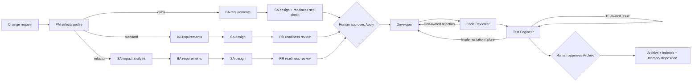

# Harness Engineering Workflow

[简体中文](README.zh-CN.md)

Harness is a repository-local engineering workflow for AI coding agents. It turns a change request into a traceable delivery package and routes the work through independent business analysis, architecture, readiness review, implementation, code review, and test engineering roles.

This repository contains Harness **3.1.4**. It is a control-plane distribution rather than an application: copy `.harness/` into a software project, generate the adapter for your agent platform, and drive changes with three commands:

```text
/harness-propose  ->  /harness-apply  ->  /harness-archive
```

Harness currently provides project-local adapters for **Claude Code**, **OpenCode**, and **Trae**. It does not install or modify global agent configuration.

## Why Harness?

AI-assisted development often collapses specification, implementation, review, and testing into one conversation. That makes ownership unclear and lets an implementation claim substitute for independent evidence. Harness separates those concerns:

- A PM coordinates the lifecycle but cannot impersonate specialist workers.
- Each worker owns a small, explicit set of files and conclusions.
- Requirements, design decisions, tasks, code changes, reviews, and test evidence remain traceable.
- Deterministic scripts validate structure, lifecycle state, evidence freshness, and archive postconditions.
- Developer and Test Engineer verification stay independent.
- The normal workflow pauses only for human approval before implementation and before archive.

Harness has four layers:

| Layer | Purpose |
| --- | --- |
| Rules | Define boundaries and decision principles. |
| Skills | Provide reusable build, test, debugging, review, and E2E procedures. |
| Agents | Run the PM and independent specialist workers. |
| Scripts | Perform deterministic scaffolding, validation, evidence auditing, and archiving. |

## Repository Layout

```text
.harness/
├── adapters/        # Platform-specific integration logic
├── checklists/      # Code-review and test-engineering gates
├── commands/        # Propose, apply, and archive orchestration contracts
├── rules/           # Workflow and reporting boundaries
├── scripts/         # Lifecycle, validation, and adapter initialization
├── skills/          # Reusable engineering procedures
├── subagents/       # Contracts for the six specialist roles
├── templates/       # Versioned task-artifact templates
├── workflow/        # Machine-readable roles, stages, and schemas
├── harness.yaml     # Runtime manifest and component registry
└── runtime.md       # PM runtime contract
```

After Harness is used in a target project, runtime data is created outside the control plane:

```text
harness/
├── board.md                 # Active-change board maintained by the PM
├── specs/<change-id>/       # Active task package and role-owned artifacts
├── archive/                 # Completed task packages and index
└── memory/                  # Reusable, evidence-backed project knowledge
```

Do not place task packages under `.harness/`. The distinction is intentional:

- `.harness/` is the reusable Harness implementation and policy control plane.
- `harness/` contains project-specific specifications, evidence, state, archives, and memory.

## Requirements

- A supported AI coding environment: Claude Code, OpenCode, or Trae.
- Python 3.
  - Windows: use `py -3`.
  - macOS/Linux: use `python3`.
- The target project's own build and test tools. Harness discovers and uses repository-native commands; it does not require a particular language or test framework.

## Install Harness in a Project

### 1. Copy the control plane

Copy this repository's `.harness/` directory into the root of the target project. Preserve the leading dot and the complete directory tree.

For example, on macOS/Linux:

```bash
cp -R /path/to/harness-cc-oc/.harness /path/to/your-project/
cd /path/to/your-project
```

On Windows PowerShell:

```powershell
Copy-Item -Recurse C:\path\to\harness-cc-oc\.harness C:\path\to\your-project\
Set-Location C:\path\to\your-project
```

If this repository itself is your project root, skip the copy step.

### 2. Preview the generated adapter

The initializer generates only project-local commands, agents, skills, and hooks. Use `--dry-run` to inspect its write set:

```bash
# macOS/Linux
python3 .harness/scripts/harness_init.py --tool all --dry-run

# Windows
py -3 .harness/scripts/harness_init.py --tool all --dry-run
```

Select one platform with `--tool claude`, `--tool opencode`, or `--tool trae`. Use `--tool all` only when the project needs all three adapters.

### 3. Generate the project-local adapter

```bash
# macOS/Linux — example for Claude Code
python3 .harness/scripts/harness_init.py --tool claude

# Windows — example for OpenCode
py -3 .harness/scripts/harness_init.py --tool opencode
```

The initializer preserves unrelated user hooks and replaces only older Harness-generated adapter entries. Generated files live under `.claude/`, `.opencode/`, or `.trae/` in the project.

### 4. Validate the installation

```bash
# macOS/Linux
python3 .harness/scripts/harness.py framework

# Windows
py -3 .harness/scripts/harness.py framework
```

Resolve reported errors before starting a change. The command checks the Harness control plane and platform contract; it does not run the target application's build or tests.

## Use Harness

The recommended interface is the three agent commands. The PM runs lifecycle scripts and delegates specialist work; users should not manually reproduce every low-level stage.

### 1. Propose a change

```text
/harness-propose Add rate limiting to the public API without changing internal service calls.
```

Harness creates an ASCII `change-id`, records a baseline, selects a profile, and routes the proposal work:

- `quick`: BA → SA with an SA readiness self-check.
- `standard`: BA → SA → independent RR.
- `refactor`: SA impact analysis → BA → SA design → independent RR.

The PM selects the profile from the scope; users do not need to configure it. When the proposal is ready, the board moves to `AWAITING_APPLY` and Harness pauses for approval.

Review the generated package under `harness/specs/<change-id>/`, especially:

- `proposal.md` and `requirements.md`
- `impact-analysis.md` for refactors
- `design.md` and `tasks.md`
- `readiness-review.md` for standard and refactor changes

### 2. Approve and apply

```text
/harness-apply <change-id>
```

Calling the command is the human approval to implement; Harness must not ask for the same approval again. It automatically routes:

```text
Developer -> Code Reviewer -> Test Engineer
```

The Developer implements bounded tasks and records reproducible verification in `dev-log.md`. The Code Reviewer independently reviews the actual diff and writes `code-review.md` without fixing code. The Test Engineer independently verifies requirements and regression scope and writes `test-report.md` without changing production code.

If a review or test fails, Harness routes the finding back to its owner and then re-runs the required downstream stages. When all apply gates pass, the board moves to `AWAITING_ARCHIVE` and pauses again.

### 3. Approve and archive

```text
/harness-archive <change-id>
```

Calling the command is the archive approval. Harness checks the apply-close gate, reconciles reusable memory drafts, updates long-lived project documentation when appropriate, moves the task package into the archive, updates indexes, and marks the board entry complete.

## Roles and Ownership

| Role | Responsibility | Owned outputs | Allowed conclusion |
| --- | --- | --- | --- |
| PM | Route workers, enforce gates, maintain the board, manage approvals and archive. It does not perform specialist work. | `harness/board.md`, archive and approved indexes | Lifecycle state |
| BA — Business Analyst | Define observable behavior, requirement deltas, SHALL requirements, Given/When/Then scenarios, and non-goals without choosing an implementation. | `proposal.md`, `requirements.md` | `PASS`, `BLOCK` |
| SA — Solution Architect | Analyze refactor impact or design the solution, map requirements, define tasks, test ownership, and an executable verification contract. | `impact-analysis.md`, `design.md`, task definitions in `tasks.md` | `PASS`, `BLOCK` |
| RR — Readiness Reviewer | Independently check requirement purity, traceability, design completeness, and task executability. It reviews but does not repair BA/SA artifacts. | `readiness-review.md` | `PASS`, `BLOCK` |
| Dev — Developer | Implement approved, bounded changes; add implementation tests; run developer-level verification; and record evidence. | Business/test changes, `dev-log.md`, Dev-owned task status | `PASS`, `BLOCK` |
| CR — Code Reviewer | Independently review the current diff, requirement coverage, implementation quality, and evidence. It never fixes reviewed code. | `code-review.md`, CR-owned task status | `PASS`, `REJECT` |
| TE — Test Engineer | Independently validate acceptance scenarios, direct impact, relevant regression, and engineering gates. It does not fix production code. | `test-report.md`, TE-owned test assets and task status | `PASS`, `FAIL`, `BLOCK` |

Every worker returns a structured packet containing its role, task name, updated artifacts, conclusion, summary, evidence, issues, and next owner. The PM cross-checks that return against the actual files; a chat-only claim is not a completed stage.

## End-to-End Workflow



Normal operation has only two human stops:

1. After propose, before apply.
2. After apply, before archive.

A genuine business decision, missing authority, security issue, or unrecoverable environment problem may introduce an earlier block. Stage-local rework otherwise advances automatically.

## Verification and Evidence

Harness deliberately separates execution from auditing:

- Dev and TE run the target project's applicable commands and record the working directory, argv, exit code, inputs, and evidence.
- Their evidence ledgers are role-specific; Dev evidence cannot satisfy TE verification.
- Changes to bounded source, configuration, or test inputs invalidate stale evidence. Unrelated working-tree changes produce warnings instead of invalidating the task.
- Normal `delivery` performs an evidence audit and does **not** rerun project commands.
- `harness.py delivery <change-id> --role <role> --replay` is reserved for explicit human diagnosis, not normal PM or hook operation.
- `apply-close` checks report schemas, PASS conclusions, evidence freshness, baseline comparison, and Dev → CR → TE ordering before archive can begin.

The Test Engineer records four coverage classes. They are categories, not four mandatory commands:

- **A:** directly affected interfaces or entry points.
- **B:** executable acceptance paths for applicable requirements and scenarios.
- **C:** one or two directly relevant historical regressions for standard/refactor changes.
- **D:** the minimum necessary independent engineering gate and applicable baseline/post-verification.

## Low-Level CLI

`.harness/scripts/harness.py` exposes deterministic lifecycle actions:

```text
init  stage  readiness  delivery  evidence-ledger  preflight
memory-disposition  apply-close  baseline  board  archive  framework
```

These commands are primarily for platform adapters, PM orchestration, hooks, and diagnosis. For routine feature work, prefer `/harness-propose`, `/harness-apply`, and `/harness-archive` so role ownership and routing remain intact.

Show command-specific help with:

```bash
python3 .harness/scripts/harness.py <command> --help  # macOS/Linux
py -3 .harness/scripts/harness.py <command> --help   # Windows
```

## Platform Notes

- **Claude Code:** installs six project agents, three commands, five skills, and project-level worker lifecycle hooks. Mechanical preflight runs before each worker stops; Dev/TE additionally receive evidence auditing.
- **OpenCode:** installs a peer `harness-pm` primary agent, six subagents, three PM-bound commands, five skills, and a project plugin. PM shell/edit access is denied; lifecycle, Git reads, and allowed PM writes go through bounded tools.
- **Trae:** installs six roles and three commands. Because there is no stable worker-completion event, the PM performs the equivalent completion validation.

If a platform cannot launch a registered worker or denies the required task operation, Harness blocks instead of silently letting the PM impersonate that role.

## License

Licensed under the [Apache License 2.0](LICENSE).
