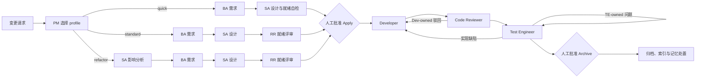

# Harness 工程交付工作流

[English](README.md)

Harness 是一个随项目存放的 AI Agent 工程交付工作流。它把一次变更请求转化为可追踪的任务包，并由相互独立的业务分析、方案设计、就绪评审、开发、代码审查和测试工程角色依次完成。

本仓库包含 Harness **3.1.4**。它不是一个业务应用，而是一套可嵌入软件项目的控制面：把 `.harness/` 复制到目标项目，生成当前 Agent 平台的项目级适配文件，然后通过三条命令驱动变更：

```text
/harness-propose  ->  /harness-apply  ->  /harness-archive
```

Harness 当前为 **Claude Code**、**OpenCode** 和 **Trae** 提供项目级适配，不安装或修改全局 Agent 配置。

## Harness 解决什么问题

普通 AI 辅助开发容易把需求、设计、实现、评审和测试压缩在同一个对话中，导致角色所有权不清晰，也容易用开发者自己的结论代替独立验证。Harness 通过以下机制约束交付：

- PM 只调度工作流，不能扮演专业 Worker。
- 每个 Worker 只拥有明确的产物和结论。
- 需求、设计、任务、代码、评审与测试证据保持可追踪。
- 确定性脚本检查文档结构、生命周期状态、证据新鲜度与归档后置条件。
- Dev 与 TE 分别执行真实、独立的验证，二者证据不能互相替代。
- 正常流程只在实施前和归档前等待两次人工批准。

Harness 由四层组成：

| 层 | 作用 |
| --- | --- |
| Rules | 定义边界和判断原则。 |
| Skills | 提供构建、测试、调试、审查和 E2E 的复用方法。 |
| Agents | 运行 PM 与相互独立的专业 Worker。 |
| Scripts | 执行确定性的脚手架、验证、证据审计和归档。 |

## 仓库结构

```text
.harness/
├── adapters/        # 平台适配逻辑
├── checklists/      # 代码审查与测试工程门禁
├── commands/        # propose、apply、archive 编排契约
├── rules/           # 工作流与报告边界
├── scripts/         # 生命周期、验证与适配初始化脚本
├── skills/          # 可复用工程方法
├── subagents/       # 六个专业角色的契约
├── templates/       # 带版本的任务产物模板
├── workflow/        # 机器可读的角色、阶段与 Schema
├── harness.yaml     # 运行清单和组件注册表
└── runtime.md       # PM 最小运行契约
```

Harness 在目标项目中运行后，会在控制面之外创建项目数据：

```text
harness/
├── board.md                 # PM 维护的活跃变更看板
├── specs/<change-id>/       # 活跃任务包和各角色产物
├── archive/                 # 已完成任务包与索引
└── memory/                  # 有证据、可复用的项目经验
```

两类目录不能混用：

- `.harness/` 是可复用的 Harness 本体和策略控制面。
- `harness/` 保存当前项目的规格、证据、状态、归档和记忆。

任务包必须放在 `harness/specs/<change-id>/`，不能放进 `.harness/`。

## 使用前提

- Claude Code、OpenCode 或 Trae 之一。
- Python 3：
  - Windows 使用 `py -3`。
  - macOS/Linux 使用 `python3`。
- 目标项目自身的构建与测试工具。Harness 使用仓库原生命令，不限定语言或测试框架。

## 接入目标项目

### 1. 复制控制面

把本仓库完整的 `.harness/` 目录复制到目标项目根目录，注意保留目录名前面的点。

macOS/Linux 示例：

```bash
cp -R /path/to/harness-cc-oc/.harness /path/to/your-project/
cd /path/to/your-project
```

Windows PowerShell 示例：

```powershell
Copy-Item -Recurse C:\path\to\harness-cc-oc\.harness C:\path\to\your-project\
Set-Location C:\path\to\your-project
```

如果当前仓库本身就是目标项目根目录，可跳过复制。

### 2. 预览平台适配文件

初始化器只生成项目级命令、Agent、Skill 和 Hook。先用 `--dry-run` 查看写入范围：

```bash
# macOS/Linux
python3 .harness/scripts/harness_init.py --tool all --dry-run

# Windows
py -3 .harness/scripts/harness_init.py --tool all --dry-run
```

可通过 `--tool claude`、`--tool opencode` 或 `--tool trae` 只选择一个平台。只有项目确实同时使用三个平台时才需要 `--tool all`。

### 3. 生成项目级适配

```bash
# macOS/Linux：以 Claude Code 为例
python3 .harness/scripts/harness_init.py --tool claude

# Windows：以 OpenCode 为例
py -3 .harness/scripts/harness_init.py --tool opencode
```

初始化器会保留与 Harness 无关的用户 Hook，只替换旧的 Harness 适配项。生成文件位于项目的 `.claude/`、`.opencode/` 或 `.trae/` 中。

### 4. 验证安装

```bash
# macOS/Linux
python3 .harness/scripts/harness.py framework

# Windows
py -3 .harness/scripts/harness.py framework
```

开始变更前应先处理该命令报告的错误。它只检查 Harness 控制面和平台契约，不会运行目标项目的构建或测试。

## 日常使用

推荐通过三条 Agent 命令使用 Harness。PM 会调用底层生命周期脚本并派发专业 Worker，用户不需要手工重复每个阶段。

### 1. 提议变更

```text
/harness-propose 为公开 API 增加限流，但不改变内部服务调用。
```

Harness 会创建 ASCII `change-id`、记录基线、自动选择 profile，并按范围路由：

- `quick`：BA → SA，由 SA 完成就绪自检。
- `standard`：BA → SA → 独立 RR。
- `refactor`：SA 影响分析 → BA → SA 方案设计 → 独立 RR。

profile 由 PM 判断，不需要用户配置。propose 完成后，看板进入 `AWAITING_APPLY` 并等待人工批准。

可重点检查 `harness/specs/<change-id>/` 下的：

- `proposal.md`、`requirements.md`
- refactor 任务的 `impact-analysis.md`
- `design.md`、`tasks.md`
- standard/refactor 任务的 `readiness-review.md`

### 2. 批准实施

```text
/harness-apply <change-id>
```

调用命令本身就是实施批准，Harness 不会重复询问。之后自动执行：

```text
Developer -> Code Reviewer -> Test Engineer
```

Developer 按有界任务实现，并把可复现验证记录到 `dev-log.md`；Code Reviewer 针对实际 diff 独立审查并写入 `code-review.md`，只审不改；Test Engineer 独立验证需求和受影响回归范围并写入 `test-report.md`，不修改生产代码。

评审或测试失败时，Harness 会按 finding 所有权退回对应角色，并重新执行必要的下游阶段。全部 apply 门禁通过后，看板进入 `AWAITING_ARCHIVE`，等待第二次人工批准。

### 3. 批准归档

```text
/harness-archive <change-id>
```

调用命令本身就是归档批准。Harness 会复核 apply-close 门禁、处置可复用经验草稿、按需更新长期项目文档、移动任务包、更新索引，并把看板任务标记为完成。

## 角色与所有权

| 角色 | 职责 | 拥有的产物 | 允许结论 |
| --- | --- | --- | --- |
| PM | 派发 Worker、执行门禁、维护看板、处理人工批准与归档；不代替专业角色工作。 | `harness/board.md`、归档与批准后的索引 | 生命周期状态 |
| BA（业务分析师） | 定义可观察行为、需求增量、SHALL 需求、Given/When/Then 场景和非目标，不选择实现方案。 | `proposal.md`、`requirements.md` | `PASS`、`BLOCK` |
| SA（解决方案架构师） | 分析重构影响或设计方案，建立需求映射、任务、测试所有权和可执行验证契约。 | `impact-analysis.md`、`design.md`、`tasks.md` 的任务定义 | `PASS`、`BLOCK` |
| RR（就绪评审员） | 独立检查需求纯净度、追踪关系、设计完整性和任务可执行性，只评审、不代修 BA/SA 产物。 | `readiness-review.md` | `PASS`、`BLOCK` |
| Dev（开发者） | 实施批准且有界的变更，编写实现测试，执行开发级验证并记录证据。 | 业务/测试代码、`dev-log.md`、Dev-owned 任务状态 | `PASS`、`BLOCK` |
| CR（代码审查员） | 独立审查当前 diff、需求覆盖、实现质量和证据，不修改被审查代码。 | `code-review.md`、CR-owned 任务状态 | `PASS`、`REJECT` |
| TE（测试工程师） | 独立验证验收场景、直接影响、相关回归和工程门禁，不修复生产代码。 | `test-report.md`、TE-owned 测试资产和任务状态 | `PASS`、`FAIL`、`BLOCK` |

每个 Worker 都要返回结构化结果，包括角色、任务名、更新产物、结论、摘要、证据、问题和下一 Owner。PM 会用实际文件交叉核对，只有聊天结论不算阶段完成。

## 完整工作流程



正常流程只在两处停下：

1. propose 完成后、apply 开始前。
2. apply 完成后、archive 开始前。

只有真实业务取舍、权限、安全或不可恢复的环境问题才会提前阻塞。阶段内返工会自动继续，不新增批准点。

## 验证与证据

Harness 明确区分“执行验证”和“审计证据”：

- Dev 与 TE 执行目标项目适用的真实命令，并记录工作目录、argv、退出码、输入和证据。
- 证据账本按角色隔离，Dev 的结果不能替代 TE 独立验证。
- 有界源码、配置或测试输入发生变化会让旧证据失效；范围外工作区变化只产生 warning。
- 正常 `delivery` 只审计报告，不重新执行项目命令。
- `harness.py delivery <change-id> --role <role> --replay` 只用于人工明确诊断，不用于正常 PM 或 Hook 流程。
- `apply-close` 在归档前检查报告 Schema、PASS 结论、证据新鲜度、基线对比和 Dev → CR → TE 时序。

TE 使用 A/B/C/D 四类覆盖，它们是分类，不代表必须执行四条命令：

- **A：** 本次变更直接影响的接口或入口。
- **B：** 适用需求和场景对应的真实可执行验收链路。
- **C：** standard/refactor 任务中 1–2 个最相关的历史回归场景。
- **D：** 当前任务最低必要的独立工程门禁，以及适用的 baseline/post-verify。

## 底层 CLI

`.harness/scripts/harness.py` 提供以下确定性动作：

```text
init  stage  readiness  delivery  evidence-ledger  preflight
memory-disposition  apply-close  baseline  board  archive  framework
```

这些动作主要供平台适配器、PM、Hook 和人工诊断使用。日常功能开发应优先使用 `/harness-propose`、`/harness-apply` 和 `/harness-archive`，以保持角色所有权和返工路由完整。

查看子命令帮助：

```bash
python3 .harness/scripts/harness.py <command> --help  # macOS/Linux
py -3 .harness/scripts/harness.py <command> --help   # Windows
```

## 平台差异

- **Claude Code：** 生成六个项目 Agent、三条命令、五个 Skill 和项目级 Worker 生命周期 Hook。Worker 结束前执行机械 preflight，Dev/TE 额外进行证据审计。
- **OpenCode：** 生成与 Build/Plan 同级的 `harness-pm` Primary Agent、六个 SubAgent、三条绑定 PM 的命令、五个 Skill 和项目插件。PM 的 Shell/Edit 被禁用，生命周期、Git 只读和允许的 PM 写入通过有界工具完成。
- **Trae：** 生成六个角色和三条命令。由于缺少稳定的 Worker 完成事件，由 PM 补跑等价的收工验证。

如果平台无法启动已注册 Worker，或所需 Task 操作被拒绝，Harness 会明确 BLOCK，不会让 PM 静默扮演该角色。

## 许可证

本项目使用 [Apache License 2.0](LICENSE)。
